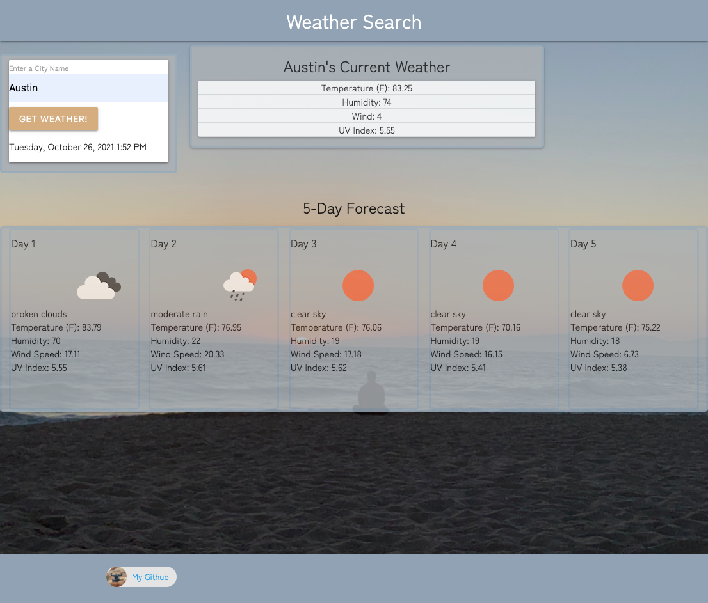

# Homework 06 Server-Side APIs: Weather Dashboard

## Description  
My challenge was to build a weather dashboard that will run in the browser and feature dynamically updated HTML and CSS.
 
## User Story
```
AS A traveler
I WANT to see the weather outlook for multiple cities
SO THAT I can plan a trip accordingly
```

## Acceptance Criteria
```
GIVEN a weather dashboard with form inputs
WHEN I search for a city
THEN I am presented with current and future conditions for that city and that city is added to the search history
WHEN I view current weather conditions for that city
THEN I am presented with the city name, the date, an icon representation of weather conditions, the temperature, the humidity, the wind speed, and the UV index
WHEN I view the UV index
THEN I am presented with a color that indicates whether the conditions are favorable, moderate, or severe
WHEN I view future weather conditions for that city
THEN I am presented with a 5-day forecast that displays the date, an icon representation of weather conditions, the temperature, the wind speed, and the humidity
WHEN I click on a city in the search history
THEN I am again presented with current and future conditions for that city
``` 
## Credits  
  MDN Web Docs, Tutor: Tyler Arthur, ASKBCS Learning Assistants. One Call Weather API Documentation. https://openweathermap.org/api/one-call-api  
  
## License MIT
[](https://opensource.org/licenses/MIT)  
    
Link: https://www.mit.edu/~amini/LICENSE.md  
    
## Questions  
For questions, please check out my Github profile or email me.  
[My Github](https://www.github.com/jones406)  
[Email Me](mailto:brookejones406@gmail.com)  


